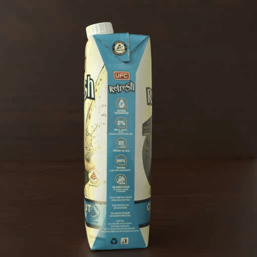
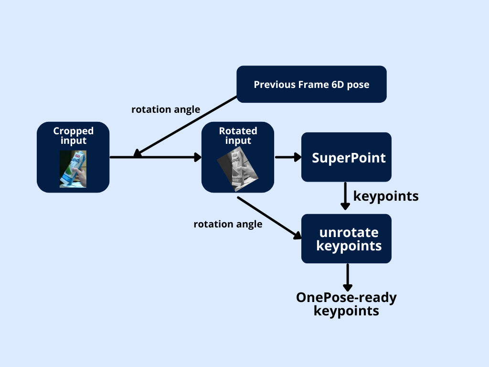

# OnePose (but with CAD Models)
## But why?
Because I want my SfM point-cloud model to be properly aligned with my CAD Model canonically so I can render stuff relative to the canonical pose of my CAD model.

- Added pipeline for realtime visualization.
- Added SuperPoint rotation limtation fix.
- Added ICP + colored-ICP refinement (requires pyrealsense and an Intel RealSense depth camera)

### [Original Project Page](https://zju3dv.github.io/onepose) | [Paper](https://arxiv.org/pdf/2205.12257.pdf)
 

> OnePose: One-Shot Object Pose Estimation without CAD Models  
> [Jiaming Sun](https://jiamingsun.ml)\*, [Zihao Wang](http://zihaowang.xyz/)\*, [Siyu Zhang](https://derizsy.github.io/)\*, [Xingyi He](https://github.com/hxy-123/), [Hongcheng Zhao](https://github.com/HongchengZhao), [Guofeng Zhang](http://www.cad.zju.edu.cn/home/gfzhang/), [Xiaowei Zhou](https://xzhou.me)   
> CVPR 2022  

Refer to the original repository for setup instructions.

## Synthetic Images from CAD Model
Images used to construct the SfM point-cloud model are generated from Blender using the desired CAD Model. Camera intrinsics and object pose (relative to the camera) are collected and processed directly using Blender's python interface. The 3D bounding box is also manually annotated in Blender, and the reprojected 2D bounding box is collected after some processing using Blender's python interface.

The 3D model is obtained using an Artec 3D scanner with some postprocessing using Artec's software. [NVIDIA MoMa](https://nvlabs.github.io/nvdiffrec/) is a good and cheap alternative if you cannot get your hands on a high-end 3D scanner.

## SuperPoint Limitation Fix

Combined with the graph attention network, SuperPoint descriptors have a rotation limitation of about 45 degrees; Tilting further than 45 degress on all axes will result in the loss of 2D-3D correspondences.

To solve this limitation, the grayscale input to SuperPoint is rotated before being passed through SuperPoint. Subsequently, the 2D coordinates of each interest point are unrotated back to the input's original orientation.

## IMPORTANT
Modified for private use-case.

- Added YoloV5 detector, weights located at data/yolov5/
- Added realtime scripts cv2_real_time_improved.py and cv2_real_time_improved.sh
- Added a modified feature-matching object detector (modified for realtime, but too slow)
- Added Open3D Pipeline for RGB-D Cameras (for ICP refinement)

## Coming Soon:
- Synthetic data generation with Blender and NVIDIA MoMa setup.

## Acknowledgement
This repository uses work from [YoloV5](https://github.com/ultralytics/yolov5) and [OnePose](https://github.com/zju3dv/OnePose), neither of which I am originally involved in.
